**完整代码收费 +   316595344     或    lz316595344  咨询** 

**接毕业设计和论文**

**如果图片加载不出来可以去博客看 https://blog.csdn.net/qq_56450993/article/details/133383546**

**毕业设计所有选题地址**

**[github]👉https://github.com/XinChennn/allProjects**

**[gitee]👉https://gitee.com/xinchennn/allProjects**

**[忻辰的个人博客]👉https://www.ixinjiu.cn/articles/156**

# SpringBoot网上商城(仿小米商城)

## 一、系统介绍

前台商城系统：包含首页登录、商品分类、新品上线、首页轮播、商品推荐、商品搜索、商品展示、购物车、订单结算、订单流程、个人订单管理、会员中心、帮助中心等模块。 

后台管理系统：包含数据面板、轮播图管理、商品管理、订单管理、会员管理、分类管理、设置等模块。

## 二、所用技术

- 后台：Springboot + Mybatis + Swagger2 + Maven + mysql
  前台：Thymeleaf + Bootstrap + AdminLTE

## 三、环境介绍

基础环境 :IDEA/eclipse, JDK 1.8, Mysql5.7, Maven

**所有项目以及源代码本人均调试运行无问题 可支持远程调试运行**

## 四、页面截图

以下为商城项目的部分页面，不一一列举，重要节点及重要功能的页面都已整理在下方，如想看项目全部可以自行下载运行。

#### 前台商城页面

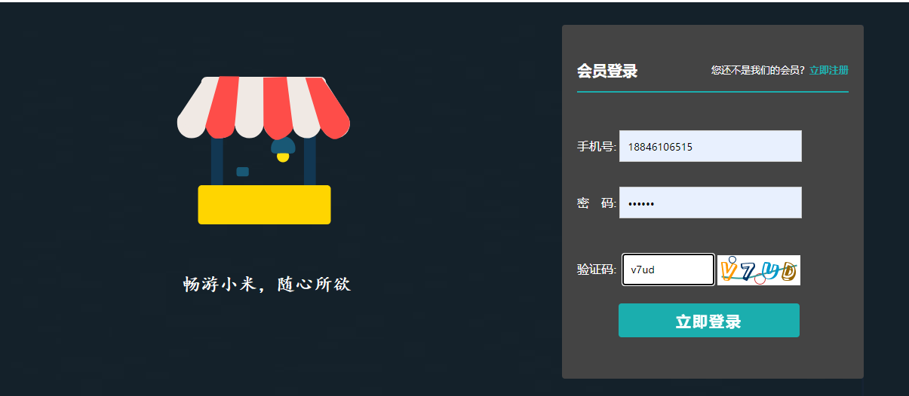

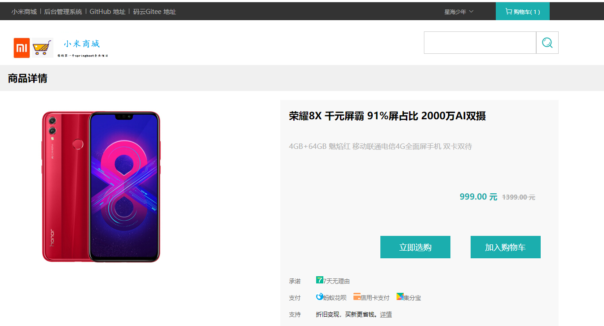

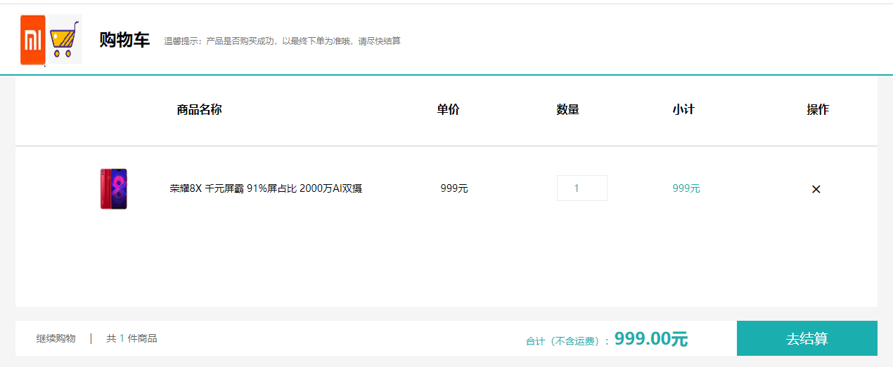

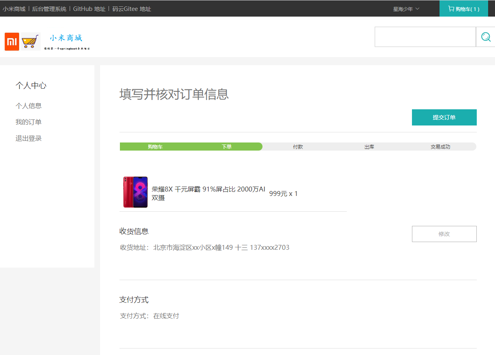

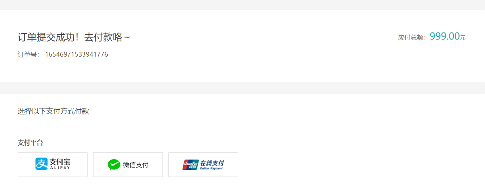

#### 后台管理页面

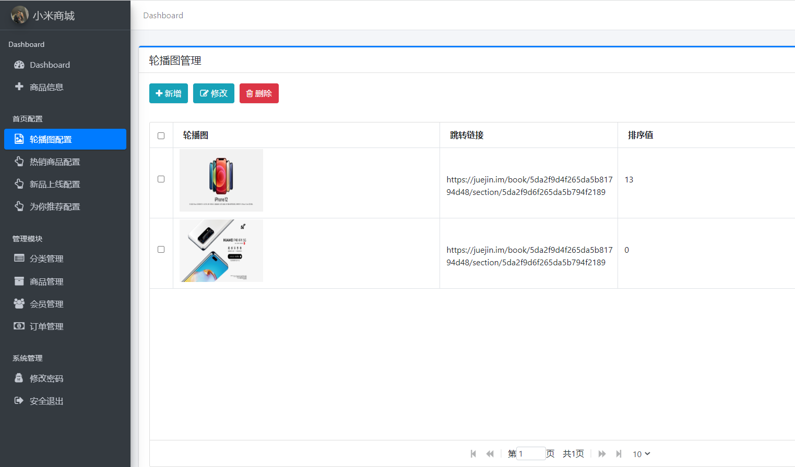

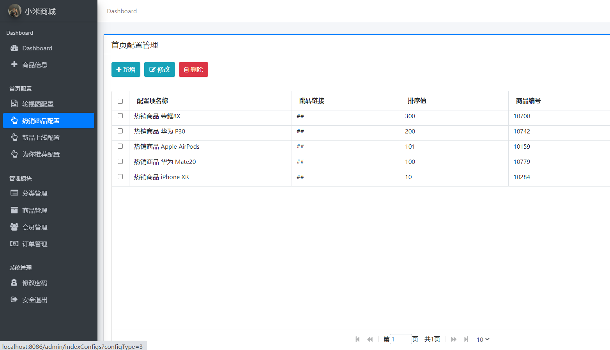

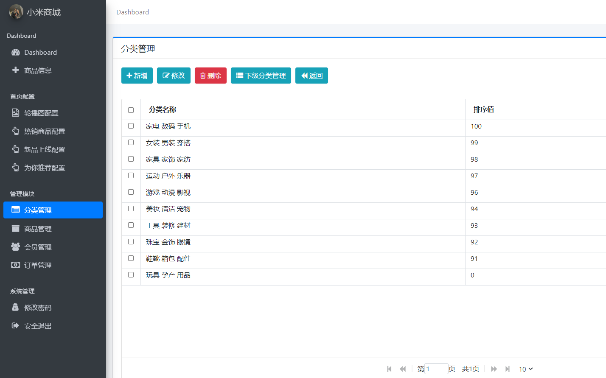

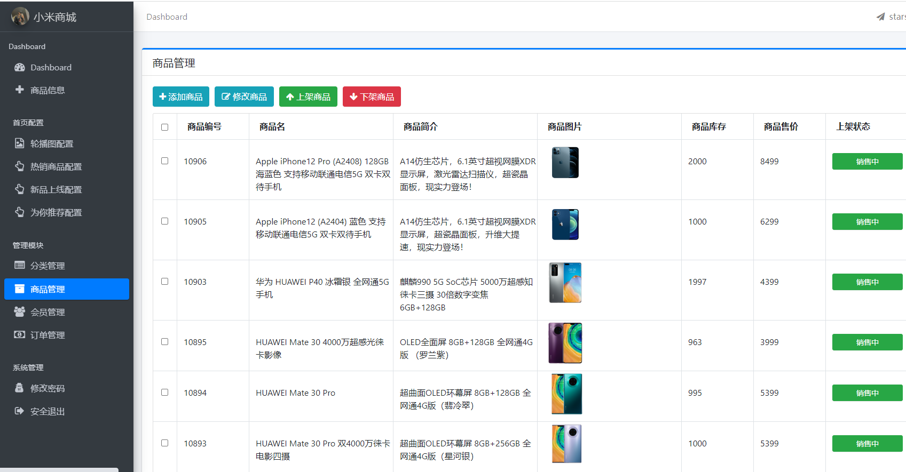

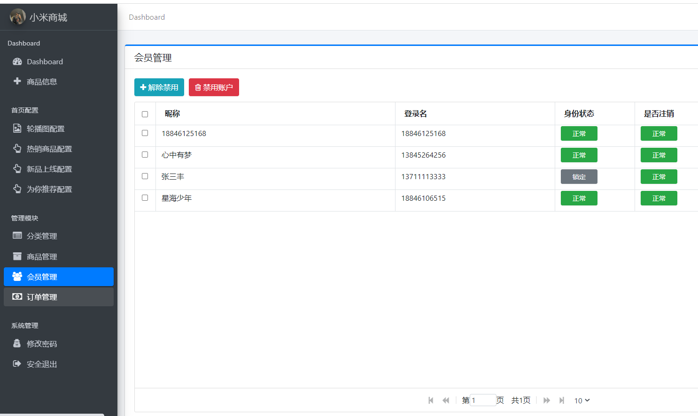

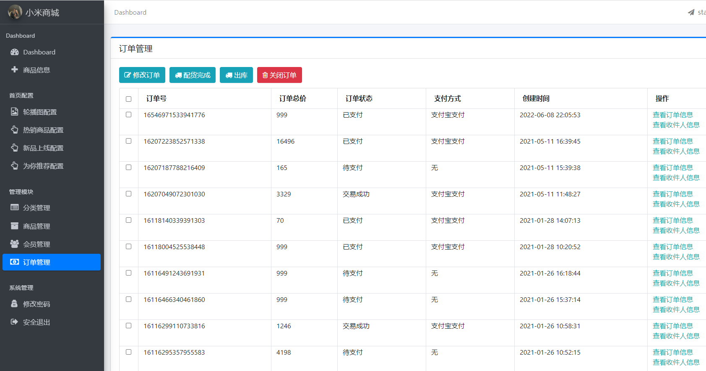

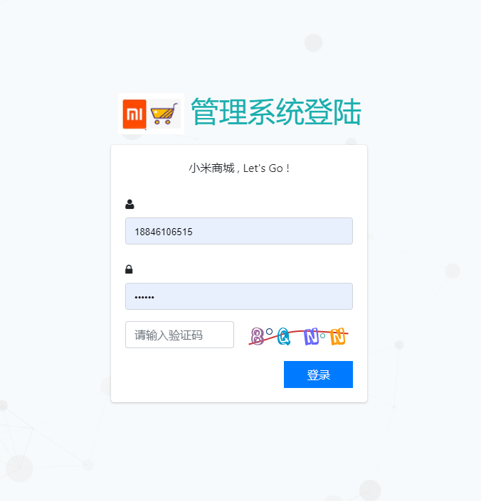

## 五、浏览地址

前台地址：http://localhost:8080

用户名：18846106515  密码：123456

后台地址：http://localhost:8080/admin/login

用户名：admin  密码：123456

## 六、安装教程

文件夹 doc/temp.txt 中有详细说明。

**完整代码 +   316595344     或    lz316595344  咨询** 

**接毕业设计和论文**
